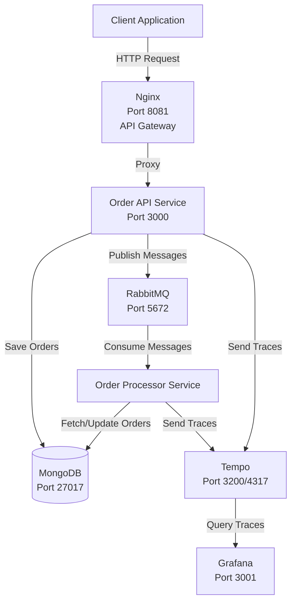
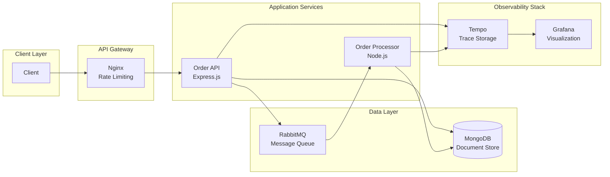
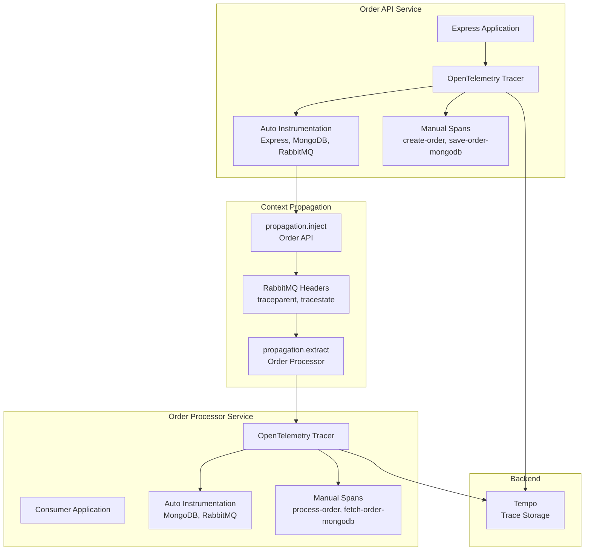
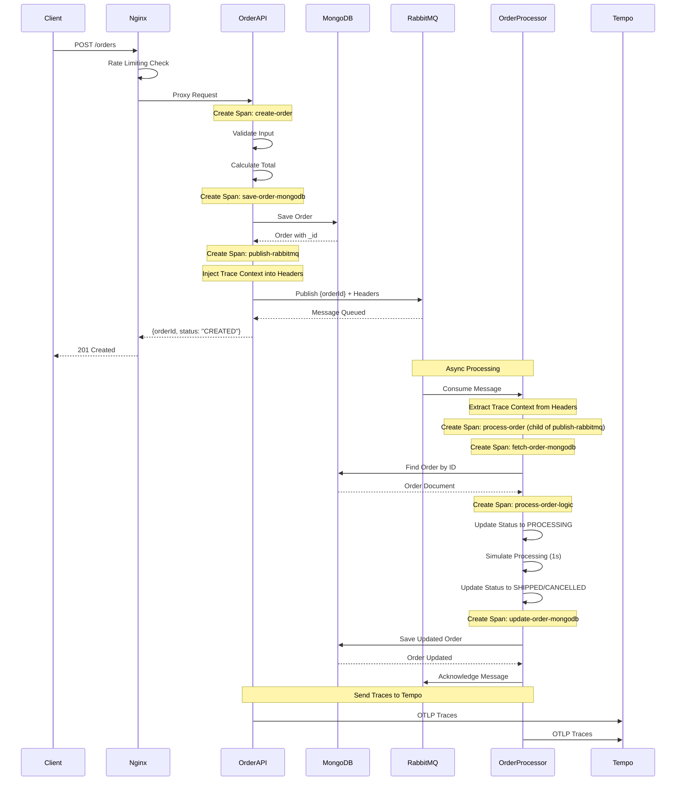
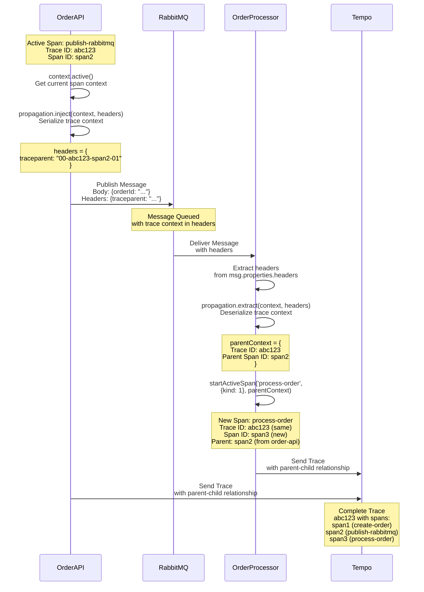

# OpenTelemetry Microservices - Comprehensive Guide

A complete guide to understanding, implementing, and observing a distributed microservices architecture with OpenTelemetry, Tempo, and Grafana.

## Table of Contents

1. [Introduction](#introduction)
2. [Theoretical Concepts](#theoretical-concepts)
3. [System Architecture](#system-architecture)
4. [Component Diagrams](#component-diagrams)
5. [Service Architecture & Code Flow](#service-architecture--code-flow)
6. [OpenTelemetry Implementation](#opentelemetry-implementation)
7. [Context Propagation Deep Dive](#context-propagation-deep-dive)
8. [Sequence Diagrams](#sequence-diagrams)
9. [Testing with Postman](#testing-with-postman)
10. [Grafana Trace Checking](#grafana-trace-checking)
11. [TraceQL Commands Reference](#traceql-commands-reference)
12. [Reference Guide](#reference-guide)

---

## Introduction

This project demonstrates a production-ready microservices architecture for order management with complete observability. The system consists of:

- **Order API Service**: RESTful API for creating and retrieving orders
- **Order Processor Service**: Background service for asynchronous order processing
- **MongoDB**: Document database for order persistence
- **RabbitMQ**: Message queue for asynchronous communication
- **Nginx**: Reverse proxy and API gateway with rate limiting
- **OpenTelemetry**: Distributed tracing across services
- **Tempo**: Trace storage and querying backend
- **Grafana**: Visualization and observability dashboard

### Key Features

- ✅ Distributed tracing across microservices
- ✅ Context propagation through RabbitMQ
- ✅ Automatic instrumentation (Express, MongoDB, RabbitMQ)
- ✅ Manual instrumentation for business logic
- ✅ Log correlation with trace IDs
- ✅ Error tracking and monitoring
- ✅ Performance analysis

---

## Theoretical Concepts

### Distributed Tracing

**What is Distributed Tracing?**

Distributed tracing is a method of observing requests as they flow through a distributed system. It helps developers understand:

- **Request Flow**: How a request moves through multiple services
- **Performance**: Where time is spent in the system
- **Dependencies**: Which services call which other services
- **Errors**: Where and why failures occur

**Key Concepts:**

1. **Trace**: A complete request flow across one or more services, identified by a unique Trace ID
2. **Span**: A single operation within a trace, representing work done in a service
3. **Context**: Information that carries trace data across service boundaries
4. **Attributes**: Key-value pairs attached to spans for filtering and searching
5. **Events**: Timestamped annotations within spans marking important moments

### OpenTelemetry

**What is OpenTelemetry?**

OpenTelemetry is an open-source observability framework that provides:

- **Unified API**: Single API for tracing, metrics, and logs
- **Vendor Neutral**: Works with any observability backend (Tempo, Jaeger, Zipkin, etc.)
- **Auto-Instrumentation**: Automatically instruments common libraries
- **Context Propagation**: Maintains trace context across service boundaries

**Instrumentation Types:**

1. **Automatic Instrumentation**: 
   - Automatically creates spans for HTTP requests, database queries, message queues
   - No code changes required
   - Works with Express, MongoDB, RabbitMQ, etc.

2. **Manual Instrumentation**:
   - Custom spans for business logic
   - Fine-grained control over what to trace
   - Adds context-specific attributes and events

### Context Propagation

**Why Context Propagation Matters:**

In a distributed system, a single request may touch multiple services. Context propagation ensures that:

- All spans from the same request share the same Trace ID
- Parent-child relationships are maintained across service boundaries
- The entire request flow can be visualized as a single trace

**W3C Trace Context Format:**

The W3C Trace Context standard defines how trace context is propagated:

- **traceparent**: Contains trace ID, parent span ID, and trace flags
- **tracestate**: Optional vendor-specific data

Example:
```
traceparent: 00-4bf92f3577b34da6a3ce929d0e0e4736-00f067aa0ba902b7-01
```

### Microservices Architecture Patterns

**Message Queue Pattern:**

- **Decoupling**: Services communicate asynchronously
- **Scalability**: Processors can scale independently
- **Reliability**: Messages are persisted, ensuring processing even if consumer is down
- **Context Propagation**: Trace context is embedded in message headers

**API Gateway Pattern:**

- **Single Entry Point**: Clients only need to know one URL
- **Rate Limiting**: Protects backend services from overload
- **Load Balancing**: Distributes requests across multiple instances
- **Security**: Hides internal service architecture

---

## System Architecture

### High-Level Architecture



### Service Responsibilities

**Order API:**
- Receives HTTP requests via Nginx
- Validates order data
- Saves orders to MongoDB
- Publishes order processing messages to RabbitMQ
- Returns order ID to client

**Order Processor:**
- Consumes messages from RabbitMQ
- Fetches orders from MongoDB
- Processes orders (business logic)
- Updates order status in MongoDB
- Acknowledges messages

**Nginx:**
- Single entry point for clients
- Rate limiting (10 req/s)
- Load balancing (future)
- Request routing

---

## Component Diagrams

### System Components



### OpenTelemetry Components



---

## Service Architecture & Code Flow

### Order API Service

#### Entry Point: `order-api/src/index.js`

**Initialization Sequence:**

```javascript
require('./tracing');  // 1. Initialize OpenTelemetry FIRST
const express = require('express');
const { connectMongoDB } = require('./services/mongodb.service');
const { connectRabbitMQ } = require('./services/rabbitmq.service');
const ordersRoutes = require('./routes/orders.routes');
```

**Why Tracing First?**
- OpenTelemetry must instrument modules before they're loaded
- Auto-instrumentation hooks into Express, MongoDB, RabbitMQ at module load time
- If tracing is loaded after these modules, instrumentation won't work

**Initialization Flow:**
1. **Tracing Initialization**: Must be first to instrument all modules
2. **Express Setup**: Creates Express app with JSON middleware
3. **Health Check**: `/health` endpoint for container health checks
4. **Route Registration**: Mounts order routes at `/orders`
5. **Error Middleware**: Global error handler
6. **Service Connections**: Connects to MongoDB and RabbitMQ
7. **Server Start**: Listens on port 3000

#### Routing Layer: `order-api/src/routes/orders.routes.js`

```javascript
router.post('/', createOrder);    // POST /orders
router.get('/:id', getOrder);     // GET /orders/:id
```

**Route Structure:**
- Uses Express Router for modular routing
- Imports controller functions from `controllers/orders.controller.js`
- Routes are mounted at `/orders` in `index.js`

#### Controller Layer: `order-api/src/controllers/orders.controller.js`

**createOrder Function Flow:**

```javascript
const tracer = trace.getTracer('order-api');
return tracer.startActiveSpan('create-order', async (span) => {
  try {
    // 1. Input Validation
    span.addEvent('Validating order input');
    
    // 2. Total Calculation
    span.addEvent('Calculating total amount');
    
    // 3. Order Creation
    span.addEvent('Creating order document');
    
    // 4. MongoDB Save (child span)
    await tracer.startActiveSpan('save-order-mongodb', async (mongoSpan) => {
      await order.save();
      mongoSpan.setAttribute('order.id', order._id.toString());
    });
    
    // 5. RabbitMQ Publish (child span with context propagation)
    await tracer.startActiveSpan('publish-rabbitmq', async (rabbitSpan) => {
      await publishMessage({ orderId: order._id.toString() });
      rabbitSpan.setAttribute('order.id', order._id.toString());
    });
    
    span.setAttribute('order.id', order._id.toString());
    span.setStatus({ code: SpanStatusCode.OK });
  } catch (error) {
    span.setStatus({ code: SpanStatusCode.ERROR, message: error.message });
  } finally {
    span.end();
  }
});
```

**Key Operations:**
- Creates parent span: `create-order`
- Creates child span: `save-order-mongodb`
- Creates child span: `publish-rabbitmq`
- Sets span attributes: `order.id`
- Adds span events for each major step

**How `order._id` is Obtained:**

1. **MongoDB Auto-Generation**: When `order.save()` is called, Mongoose/MongoDB automatically generates a unique `_id` (ObjectId) if not provided
2. **After Save**: The `order` object is updated with the `_id` field
3. **Span Attribute**: `order._id.toString()` converts ObjectId to string and sets it as a span attribute
4. **Purpose**: This attribute allows filtering traces by order ID in Grafana

#### Service Layer

**MongoDB Service** (`order-api/src/services/mongodb.service.js`):

```javascript
async function connectMongoDB() {
  await mongoose.connect(config.mongoUri, {
    useNewUrlParser: true,
    useUnifiedTopology: true,
    serverSelectionTimeoutMS: 5000,
  });
}
```

**Features:**
- Connection with retry logic
- Replica set support
- Connection pooling (handled by Mongoose)
- Auto-reconnection on failure

**RabbitMQ Service** (`order-api/src/services/rabbitmq.service.js`):

**Context Propagation Implementation:**

```javascript
const { context, propagation } = require('@opentelemetry/api');

async function publishMessage(message) {
  const headers = {};
  // Inject current trace context into headers
  propagation.inject(context.active(), headers);
  
  channel.sendToQueue(config.queueName, Buffer.from(JSON.stringify(message)), {
    persistent: true,
    headers,  // Context is in headers
  });
}
```

**What Happens:**
- `context.active()` gets the current active span context
- `propagation.inject()` serializes trace context into headers
- Headers contain: `traceparent`, `tracestate` (W3C Trace Context format)
- These headers are sent with the RabbitMQ message

**Example Headers:**
```javascript
{
  traceparent: "00-4bf92f3577b34da6a3ce929d0e0e4736-00f067aa0ba902b7-01",
  tracestate: ""
}
```

**Important Note:** The headers contain **trace context** (trace ID, span ID), NOT business data like `order.id`. The `order.id` is in the message body, while trace context is in headers for propagation.

### Order Processor Service

#### Entry Point: `order-processor/src/index.js`

```javascript
require('./tracing');  // Initialize OpenTelemetry FIRST
const { connectMongoDB } = require('./services/mongodb.service');
const { connectRabbitMQ } = require('./services/rabbitmq.service');
const { processOrderMessage } = require('./consumers/order.consumer');
```

**Initialization Flow:**
1. Tracing initialization
2. MongoDB connection
3. RabbitMQ connection with consumer setup
4. Message consumption from `order_queue`

#### Consumer: `order-processor/src/consumers/order.consumer.js`

**processOrderMessage Function Flow:**

```javascript
const tracer = trace.getTracer('order-processor');
const headers = msg.properties.headers || {};

// Extract trace context from message headers
const parentContext = propagation.extract(context.active(), headers);

// Create span with extracted context as parent
return tracer.startActiveSpan('process-order', { kind: 1 }, parentContext, async (span) => {
  try {
    const { orderId } = JSON.parse(msg.content.toString());
    span.setAttribute('order.id', orderId);
    
    // 1. Fetch Order (child span)
    await tracer.startActiveSpan('fetch-order-mongodb', async (fetchSpan) => {
      const order = await Order.findById(orderId);
      fetchSpan.setAttribute('order.id', orderId);
    });
    
    // 2. Business Logic (child span)
    await tracer.startActiveSpan('process-order-logic', async (logicSpan) => {
      // Process order...
    });
    
    // 3. Update Order (child span)
    await tracer.startActiveSpan('update-order-mongodb', async (updateSpan) => {
      await order.save();
      updateSpan.setAttribute('order.id', orderId);
    });
    
    span.setStatus({ code: SpanStatusCode.OK });
  } catch (error) {
    span.setStatus({ code: SpanStatusCode.ERROR, message: error.message });
  } finally {
    span.end();
  }
});
```

**How Context Propagation Works:**

1. **Extraction**: `propagation.extract()` deserializes trace context from headers
2. **Parent Context**: The extracted context becomes the parent context
3. **Child Span**: New span is created as a child of the parent span
4. **Trace Continuity**: Same Trace ID, different Span ID, maintaining parent-child relationship

**Span Kind:**
- `{ kind: 1 }` = `SpanKind.CONSUMER` (indicates this is a message consumer)

### Data Layer & Models

#### Order Model

**Pre-save Hook:**

```javascript
OrderSchema.pre('save', function(next) {
  if (this.isModified('items') && !this.totalAmount) {
    this.totalAmount = this.items.reduce((total, item) => {
      return total + (item.price * item.quantity);
    }, 0);
  }
  next();
});
```

**Why Needed:**
- Automatically calculates `totalAmount` if not provided
- Ensures data consistency
- Reduces code duplication in controllers
- Runs before MongoDB save operation

**Data Flow:**

1. **Order Creation** (Order API):
   - Controller creates Order instance
   - Model validates data
   - Pre-save hook calculates total if needed
   - Mongoose saves to MongoDB
   - Returns saved document with `_id`

2. **Order Processing** (Order Processor):
   - Consumer fetches order by ID
   - Updates order fields (status, paymentStatus, trackingNumber)
   - Mongoose validates updates
   - Saves updated order
   - MongoDB updates document

### Nginx Integration

**Configuration**: `nginx/nginx.conf`

```nginx
upstream order_api {
  server order-api:3000;
}

server {
  listen 80;
  location /orders {
    limit_req zone=mylimit burst=20;  # Rate limiting
    proxy_pass http://order_api;
  }
}
```

**Features:**
- Reverse proxy from port 8081 to 3000
- Rate limiting: 10 requests/second (burst: 20)
- Request header preservation
- Single entry point for clients

---

## OpenTelemetry Implementation

### Tracing Initialization

#### Order API: `order-api/src/tracing.js`

```javascript
const { NodeSDK } = require('@opentelemetry/sdk-node');
const { getNodeAutoInstrumentations } = require('@opentelemetry/auto-instrumentations-node');
const { OTLPTraceExporter } = require('@opentelemetry/exporter-otlp-grpc');

const instrumentations = getNodeAutoInstrumentations({
  '@opentelemetry/instrumentation-express': { enabled: true },
  '@opentelemetry/instrumentation-mongodb': { enabled: true },
  '@opentelemetry/instrumentation-amqplib': { enabled: true },
  '@opentelemetry/instrumentation-winston': { enabled: true },
  '@opentelemetry/instrumentation-grpc': { enabled: true },
});

const sdk = new NodeSDK({
  traceExporter: new OTLPTraceExporter({
    url: 'http://tempo:4317',
  }),
  instrumentations: [instrumentations],
  serviceName: 'order-api',
});

sdk.start();
```

**Key Points:**
- **Early Initialization**: Must be required first
- **Auto-Instrumentation**: Automatically instruments Express, MongoDB, RabbitMQ, Winston
- **OTLP Exporter**: Sends traces to Tempo via gRPC (port 4317)
- **Service Name**: Identifies service in traces (`order-api`)

### Span Hierarchy

**Complete Span Hierarchy:**

```
create-order (order-api)
├── save-order-mongodb (order-api)
│   └── mongodb.save (auto, MongoDB instrumentation)
└── publish-rabbitmq (order-api)
    ├── amqp.publish (auto, RabbitMQ instrumentation)
    └── process-order (order-processor) [CONTEXT PROPAGATED]
        ├── fetch-order-mongodb (order-processor)
        │   └── mongodb.find (auto, MongoDB instrumentation)
        ├── process-order-logic (order-processor)
        └── update-order-mongodb (order-processor)
            └── mongodb.save (auto, MongoDB instrumentation)
```

### Logger Integration

**File**: `order-api/src/utils/logger.js`

```javascript
const winston = require('winston');
const { trace, context } = require('@opentelemetry/api');

const logger = winston.createLogger({
  format: winston.format.combine(
    winston.format.timestamp(),
    winston.format.json(),
    winston.format.metadata({
      fillWith: () => ({
        traceId: trace.getSpan(context.active())?.spanContext().traceId || 'n/a',
      }),
    })
  ),
});
```

**How It Works:**
1. **Active Span Detection**: `trace.getSpan(context.active())` gets current active span
2. **Trace ID Extraction**: `spanContext().traceId` extracts trace ID
3. **Automatic Injection**: Winston metadata formatter adds trace ID to every log
4. **Fallback**: Returns `'n/a'` if no active span

**Log Output Example:**
```json
{
  "level": "info",
  "message": "Order created: 507f1f77bcf86cd799439011",
  "timestamp": "2025-12-10T04:11:23.279Z",
  "traceId": "abe73447471bda8e2ab41b8c20290c9b"
}
```

### Event Tracking

Events are timestamped annotations within spans:

**Events in Order API:**
- `'Validating order input'`
- `'Calculating total amount'`
- `'Creating order document'`
- `'Saving Order to MongoDB'`
- `'Publishing message to RabbitMQ'`

**Events in Order Processor:**
- `'Fetching order from MongoDB'`
- `'Processing order business logic'`
- `'Updating order in MongoDB'`

---

## Context Propagation Deep Dive

### How Context Propagation Works

Context propagation maintains trace continuity across service boundaries. In this system, it flows:

1. **Order API** → **RabbitMQ** (via message headers)
2. **RabbitMQ** → **Order Processor** (extracted from message headers)

### Step-by-Step Context Propagation

#### Step 1: Injecting Context (Order API)

**File**: `order-api/src/services/rabbitmq.service.js`

```javascript
const headers = {};
propagation.inject(context.active(), headers);
// headers = { traceparent: "00-4bf92f3577b34da6a3ce929d0e0e4736-..." }

channel.sendToQueue(config.queueName, Buffer.from(JSON.stringify(message)), {
  persistent: true,
  headers,  // Contains trace context
});
```

**What's in the Headers:**

The `traceparent` header contains:
- **Version**: `00` (W3C Trace Context version)
- **Trace ID**: `4bf92f3577b34da6a3ce929d0e0e4736` (128-bit identifier for the entire trace)
- **Parent Span ID**: `00f067aa0ba902b7` (64-bit identifier for the parent span)
- **Trace Flags**: `01` (sampling flag)

**Important**: The headers contain **trace context** (trace ID, span ID), NOT business data. The `order.id` is in the message body, while trace context is in headers for propagation.

#### Step 2: Extracting Context (Order Processor)

**File**: `order-processor/src/consumers/order.consumer.js`

```javascript
const headers = msg.properties.headers || {};
const parentContext = propagation.extract(context.active(), headers);
// parentContext = Contains trace ID and parent span ID from order-api

return tracer.startActiveSpan('process-order', { kind: 1 }, parentContext, async (span) => {
  // This span is now a child of the span from order-api
});
```

**What Happens:**
- Extracts headers from RabbitMQ message
- `propagation.extract()` deserializes trace context
- Creates new span as child of parent span
- Maintains trace continuity across services

### Visual Representation

```
Order API Service
│
├─ Span: create-order (Trace ID: abc123, Span ID: span1)
│  │
│  └─ Span: publish-rabbitmq (Trace ID: abc123, Span ID: span2)
│     │
│     └─ [Context Injected into Headers]
│        │
│        ▼
│     RabbitMQ Message
│     Headers: { traceparent: "00-abc123-span2-01" }
│     Body: { orderId: "6938fc36afd453f5be7d5727" }
│        │
│        ▼
│     [Context Extracted from Headers]
│        │
│        ▼
Order Processor Service
│
└─ Span: process-order (Trace ID: abc123, Span ID: span3)
   │
   └─ Parent: span2 (from order-api)
   └─ Same Trace ID: abc123 (maintains trace continuity)
```

### Why Context Propagation Matters

1. **Trace Continuity**: Single trace across multiple services
2. **Request Tracking**: Follow a request from API to processor
3. **Performance Analysis**: See total time across services
4. **Error Correlation**: Link errors across service boundaries
5. **Debugging**: Understand request flow end-to-end

---

## Sequence Diagrams

### Complete Order Creation and Processing Flow



### Context Propagation Flow



---

## Testing with Postman

### Setup Instructions

1. **Create Postman Environment:**
   - `base_url`: `http://localhost:8081`
   - `api_url`: `http://localhost:3000`
   - `order_id`: (will be set after order creation)

2. **Create Postman Collection:**
   - Folder: "Successful Tests"
   - Folder: "Error Tests"

### Successful Test Cases

#### Test 1: Health Check

**Request:**
- Method: `GET`
- URL: `{{base_url}}/health`

**Expected Response:**
- Status: `200 OK`
- Body: `{ "status": "OK" }`

#### Test 2: Create Order

**Request:**
- Method: `POST`
- URL: `{{base_url}}/orders`
- Headers: `Content-Type: application/json`
- Body:
```json
{
  "customerId": "CUST001",
  "customerEmail": "alice.johnson@email.com",
  "items": [
    {
      "productId": "LAPTOP001",
      "name": "MacBook Pro 16-inch",
      "quantity": 1,
      "price": 2499.99
    }
  ],
  "shippingAddress": {
    "street": "123 Main Street",
    "city": "New York",
    "state": "NY",
    "zipCode": "10001",
    "country": "USA"
  }
}
```

**Expected Response:**
- Status: `201 Created`
- Body: `{ "orderId": "...", "status": "CREATED" }`

**Post-Request Script:**
```javascript
if (pm.response.code === 201) {
    const response = pm.response.json();
    pm.environment.set("order_id", response.orderId);
}
```

#### Test 3: Get Order

**Request:**
- Method: `GET`
- URL: `{{base_url}}/orders/{{order_id}}`

**Expected Response:**
- Status: `200 OK`
- Body: Complete order object

### Error Test Cases

#### Error Test 1: Missing Required Fields

**Request:**
- Method: `POST`
- URL: `{{base_url}}/orders`
- Body:
```json
{
  "customerId": "CUST_ERROR"
}
```

**Expected Response:**
- Status: `400 Bad Request`
- Body: `{ "error": "Missing required fields" }`

#### Error Test 2: Invalid Order ID

**Request:**
- Method: `GET`
- URL: `{{base_url}}/orders/INVALID_ID_12345`

**Expected Response:**
- Status: `404 Not Found`
- Body: `{ "error": "Order not found" }`

#### Error Test 3: Missing Item Fields

**Request:**
- Method: `POST`
- URL: `{{base_url}}/orders`
- Body:
```json
{
  "customerId": "CUST_ERROR",
  "customerEmail": "test@error.com",
  "items": [{"productId": "PROD001"}],
  "shippingAddress": {...}
}
```

**Expected Response:**
- Status: `400 Bad Request`
- Body: `{ "error": "Item price or quantity missing" }`

### Complete Test Collection

For complete test cases including all error scenarios, see the [Postman Tests](#postman-test-cases) section below.

---

## Grafana Trace Checking

### Accessing Grafana

1. Open http://localhost:3001
2. Go to **Explore**
3. Select **Tempo** datasource
4. Choose **TraceQL** query type

### Basic Trace Queries

#### View All Traces from Order API

```
{ .service.name = "order-api" }
```

#### View All Traces from Order Processor

```
{ .service.name = "order-processor" }
```

#### View Complete Order Flow

```
{ name = "create-order" } || { name = "save-order-mongodb" } || { name = "publish-rabbitmq" } || { name = "process-order" } || { name = "fetch-order-mongodb" } || { name = "process-order-logic" } || { name = "update-order-mongodb" }
```

### Trace Analysis Steps

1. **Find Trace by Service:**
   - Use `{ .service.name = "order-api" }` to find all order API traces
   - Click on a trace to view details

2. **View Span Hierarchy:**
   - Expand spans to see parent-child relationships
   - Check that `process-order` is a child of `publish-rabbitmq`

3. **Check Context Propagation:**
   - Verify same Trace ID across services
   - Check parent span ID matches between services

4. **View Span Details:**
   - Click on a span to see:
     - Attributes (e.g., `order.id`)
     - Events (e.g., "Saving Order to MongoDB")
     - Duration
     - Status (OK or ERROR)

5. **Filter by Order ID:**
   - Use span attributes to filter: `{ .order.id = "6938fc36afd453f5be7d5727" }`
   - Note: This requires the attribute to be indexed in Tempo

6. **Check for Errors:**
   - Use `{ status = error }` to find all error spans
   - Check error messages in span details

### Trace Visualization

**What to Look For:**

1. **Trace Continuity:**
   - Same Trace ID from Order API to Order Processor
   - Parent-child relationship visible in span tree

2. **Span Attributes:**
   - `order.id` attribute on relevant spans
   - Service name attribute on all spans

3. **Events:**
   - Events marking important operations
   - Timestamps showing operation sequence

4. **Duration:**
   - Time spent in each span
   - Total trace duration

5. **Status:**
   - OK status for successful operations
   - ERROR status for failures

---

## TraceQL Commands Reference

### Basic Service Queries

**Order API Service:**
```
{ .service.name = "order-api" }
```

**Order Processor Service:**
```
{ .service.name = "order-processor" }
```

**Both Services:**
```
{ .service.name = "order-api" } || { .service.name = "order-processor" }
```

### Span Name Queries

**Create Order:**
```
{ name = "create-order" }
```

**Process Order:**
```
{ name = "process-order" }
```

**All MongoDB Operations:**
```
{ name = "save-order-mongodb" } || { name = "fetch-order-mongodb" } || { name = "update-order-mongodb" }
```

### Duration Queries

**Slow Operations (> 0.2 seconds):**
```
{ duration > 0.2s }
```

**Slow Order Processor:**
```
{ .service.name = "order-processor" } | { duration > 0.2s }
```

**Slow MongoDB Operations:**
```
{ name = "save-order-mongodb" } | { duration > 0.5s }
```

### Error Queries

**All Errors:**
```
{ status = error }
```

**Errors in Order API:**
```
{ .service.name = "order-api" } | { status = error }
```

**Errors in Order Processing:**
```
{ name = "process-order" } | { status = error }
```

### Combined Queries

**Slow Order API Create:**
```
{ .service.name = "order-api" } | { name = "create-order" } | { duration > 1s }
```

**All MongoDB Errors:**
```
({ name = "save-order-mongodb" } || { name = "fetch-order-mongodb" } || { name = "update-order-mongodb" }) | { status = error }
```

**Complete Order Flow:**
```
{ name = "create-order" } || { name = "save-order-mongodb" } || { name = "publish-rabbitmq" } || { name = "process-order" } || { name = "fetch-order-mongodb" } || { name = "process-order-logic" } || { name = "update-order-mongodb" }
```

### TraceQL Syntax Reference

**Operators:**
- `=` : Equals
- `!=` : Not equals
- `>` : Greater than
- `<` : Less than
- `||` : Logical OR (for multiple conditions)
- `|` : Pipeline operator (for filtering)

**Field Names:**
- `.service.name` : Service name (resource attribute)
- `name` : Span name
- `status` : Span status (error, ok, unset)
- `duration` : Span duration

**Duration Units:**
- `s` : Seconds
- `ms` : Milliseconds

**Usage Tips:**
1. Use parentheses when combining `||` and filtering: `({ condition1 } || { condition2 }) | { filter }`
2. Use `||` for OR operations (not `or`)
3. Use `|` for pipeline filtering
4. Always use `.service.name` with dot prefix
5. Duration must include unit (`s` or `ms`)

---

## Reference Guide

### File-Wise Code Reference

#### Order Creation Flow

**1. Client Request → Nginx**
- File: `nginx/nginx.conf`
- Action: Rate limiting, proxy to Order API

**2. Nginx → Order API Route**
- File: `order-api/src/routes/orders.routes.js`
- Action: Routes POST `/orders` to `createOrder` controller

**3. Order API Controller**
- File: `order-api/src/controllers/orders.controller.js`
- Function: `createOrder(req, res, next)`
- Actions:
  - Creates `create-order` span
  - Validates input
  - Calculates total
  - Creates Order model instance

**4. Order Model Pre-save Hook**
- File: `order-api/src/models/order.model.js`
- Action: Calculates `totalAmount` if not provided

**5. MongoDB Save**
- File: `order-api/src/controllers/orders.controller.js`
- Function: `createOrder` → `save-order-mongodb` span
- Action: `await order.save()` → MongoDB generates `_id`

**6. RabbitMQ Publish**
- File: `order-api/src/controllers/orders.controller.js`
- Function: `createOrder` → `publish-rabbitmq` span
- File: `order-api/src/services/rabbitmq.service.js`
- Function: `publishMessage(message)`
- Actions:
  - `propagation.inject(context.active(), headers)` → Injects trace context
  - Publishes `{ orderId: order._id.toString() }` to RabbitMQ queue
  - Headers contain trace context (traceparent, tracestate)

**7. Response to Client**
- File: `order-api/src/controllers/orders.controller.js`
- Action: Returns `{ orderId, status: "CREATED" }`

#### Order Processing Flow

**1. RabbitMQ Consumer**
- File: `order-processor/src/consumers/order.consumer.js`
- Function: `processOrderMessage(msg, channel)`
- Actions:
  - Extracts headers: `msg.properties.headers`
  - `propagation.extract(context.active(), headers)` → Extracts trace context
  - Creates `process-order` span with extracted context as parent

**2. Fetch Order from MongoDB**
- File: `order-processor/src/consumers/order.consumer.js`
- Function: `processOrderMessage` → `fetch-order-mongodb` span
- Action: `await Order.findById(orderId)`

**3. Business Logic Processing**
- File: `order-processor/src/consumers/order.consumer.js`
- Function: `processOrderMessage` → `process-order-logic` span
- Actions:
  - Updates status to `PROCESSING`
  - Simulates work (1s delay)
  - Updates status to `SHIPPED` (90%) or `CANCELLED` (10%)

**4. Update Order in MongoDB**
- File: `order-processor/src/consumers/order.consumer.js`
- Function: `processOrderMessage` → `update-order-mongodb` span
- Action: `await order.save()` → Updates order in MongoDB

**5. Message Acknowledgment**
- File: `order-processor/src/consumers/order.consumer.js`
- Action: `channel.ack(msg)` on success, `channel.nack(msg)` on error

### OpenTelemetry API Reference

**Imports:**
```javascript
const { 
  trace,           // For creating tracers and spans
  context,         // For context management
  propagation,     // For context propagation
  SpanStatusCode   // For span status codes
} = require('@opentelemetry/api');
```

**Tracer Creation:**
```javascript
const tracer = trace.getTracer('service-name');
```

**Span Creation:**
```javascript
// Simple span
tracer.startActiveSpan('span-name', async (span) => {
  // Your code
  span.end();
});

// Span with parent context
tracer.startActiveSpan('span-name', { kind: 1 }, parentContext, async (span) => {
  // Your code
  span.end();
});
```

**Span Status:**
```javascript
// Success
span.setStatus({ code: SpanStatusCode.OK });

// Error
span.setStatus({ code: SpanStatusCode.ERROR, message: error.message });
```

**Span Attributes:**
```javascript
span.setAttribute('order.id', orderId);
span.setAttribute('order.status', status);
```

**Span Events:**
```javascript
span.addEvent('Event description');
```

**Context Propagation:**
```javascript
// Inject context
const headers = {};
propagation.inject(context.active(), headers);

// Extract context
const parentContext = propagation.extract(context.active(), headers);
```

**Span Context:**
```javascript
const spanContext = span.spanContext();
const traceId = spanContext.traceId;
const spanId = spanContext.spanId;
const traceFlags = spanContext.traceFlags;
```

### Key Concepts Summary

**1. Trace**
- Represents a complete request flow
- Contains multiple spans
- Identified by Trace ID

**2. Span**
- Represents a single operation
- Has parent-child relationships
- Contains events, attributes, status

**3. Context**
- Carries trace information
- Propagated across service boundaries
- Maintains parent-child relationships

**4. Events**
- Timestamped annotations in spans
- Mark important moments
- Help understand flow

**5. Attributes**
- Key-value pairs on spans
- Used for filtering and searching
- Add business context

**6. Status**
- Indicates span success/failure
- ERROR status for failures
- OK status for success

---

## Summary

This comprehensive guide covers:

✅ **Theoretical Concepts**: Distributed tracing, OpenTelemetry, context propagation  
✅ **System Architecture**: Component diagrams, service responsibilities  
✅ **Code Flow**: File-by-file reference, function-level details  
✅ **OpenTelemetry Implementation**: Tracing setup, span creation, context propagation  
✅ **Sequence Diagrams**: Visual representation of request flow  
✅ **Testing**: Postman test cases for success and error scenarios  
✅ **Grafana Trace Checking**: How to query and analyze traces  
✅ **TraceQL Commands**: Complete reference for querying traces  

The system provides complete observability of the distributed order processing pipeline, making it easy to debug issues, analyze performance, and understand request flows across services.

---

**Happy Tracing! 🚀**

